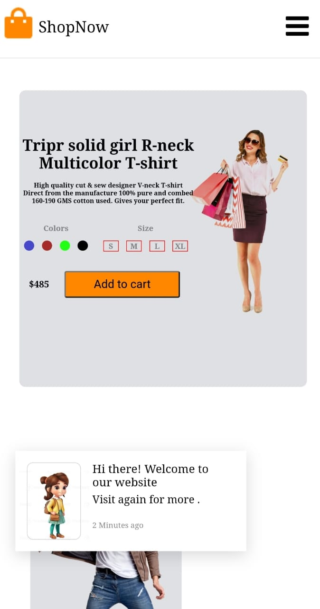

<div align="center">


  <h2 align="center">Responsive-Blog-Website</h2>

  Its is a fully responsive Blog website, <br />Responsive for all devices, build using HTML, CSS.

  <div align="center">

  <br />
  <br />

 
 
## Live Demo
[](responsiveblog-template.netlify.app)

## Screenshot


</div>

<br />

### Demo Screeshots


### Prerequisites

Before you begin, ensure you have met the following requirements:

* [Git](https://git-scm.com/downloads "Download Git") must be installed on your operating system.

### Run Locally

To run **blog** locally, run this command on your git bash:

Linux and macOS:

```bash
sudo git clone (https://github.com/Shivendrasis/Responsive-Blog-Template/)
```

Windows:

```bash
git clone (https://github.com/Shivendrasis/Responsive-Blog-Template/)
```

### Contact

If you want to contact with me you can reach me at [Instagram](https://www.instagram.com/iamshivendrasisodia).

### License

This project is **free to use** and does not contains any license."><strong>➥ Live Demo</strong></a>

</div>

<br />

### Demo Screeshots

<center>


### Prerequisites

Before you begin, ensure you have met the following requirements:

* [Git](https://git-scm.com/downloads "Download Git") must be installed on your operating system.

### Run Locally

To run **Blog website** locally, run this command on your git bash:

Linux and macOS:

```bash
sudo git clone https://github.com/Shivendrasis/Responsive-Blog-Template.git
```

Windows:

```bash
git clone https://github.com/Shivendrasis/Responsive-Blog-Template.git
```

### Contact

If you want to contact with me you can reach me at [Instagram](https://www.instagram.com/shivendrasisodia).

### License

This project is **free to use** and does not contains any license.
